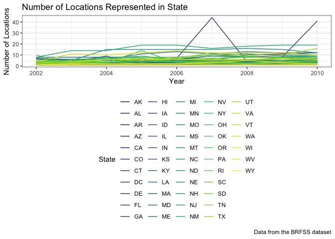
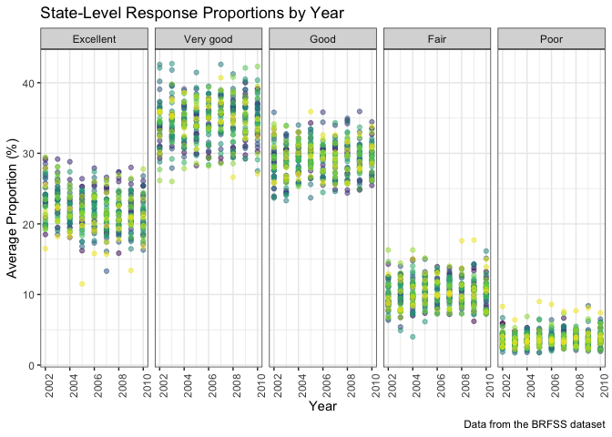
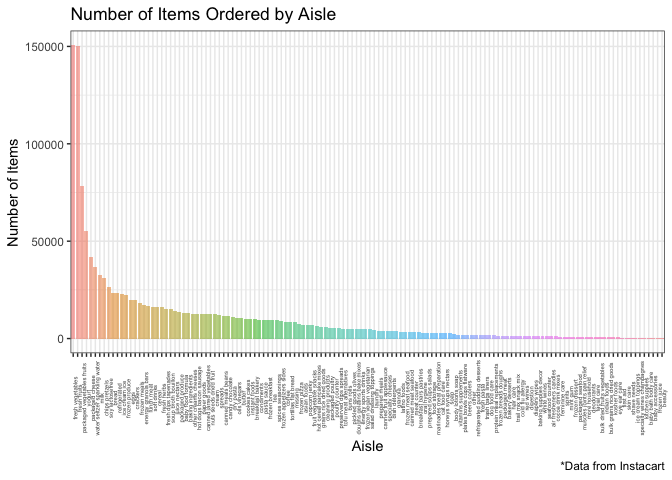
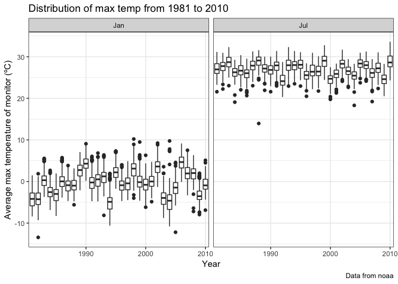
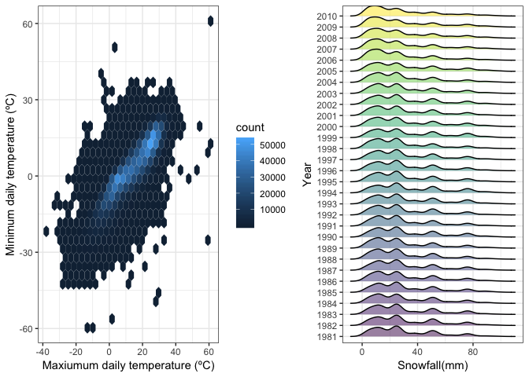

p8105\_hw3\_jh4054
================
Joy Hsu
10/12/2018

This R Markdown for HW3 reinforces skills from Data Visualization and Exploratory Data Analysis

Setup
=====

Load relevant packages and set global chunk options

``` r
library(tidyverse)
## ── Attaching packages ─────────────────────────────────────────────────────────────────── tidyverse 1.2.1 ──
## ✔ ggplot2 3.0.0     ✔ purrr   0.2.5
## ✔ tibble  1.4.2     ✔ dplyr   0.7.6
## ✔ tidyr   0.8.1     ✔ stringr 1.3.1
## ✔ readr   1.1.1     ✔ forcats 0.3.0
## ── Conflicts ────────────────────────────────────────────────────────────────────── tidyverse_conflicts() ──
## ✖ dplyr::filter() masks stats::filter()
## ✖ dplyr::lag()    masks stats::lag()
library(patchwork)
library(viridis)
## Loading required package: viridisLite
library(janitor)
library(ggridges)
## 
## Attaching package: 'ggridges'
## The following object is masked from 'package:ggplot2':
## 
##     scale_discrete_manual
library(p8105.datasets)

knitr::opts_chunk$set(
  warning = FALSE, 
  message = FALSE)
```

Problem 1
=========

Load and clean brfss\_smart2010 dataset.

``` r
brfss = p8105.datasets::brfss_smart2010 %>% 
  janitor::clean_names() %>% 
  filter(topic == "Overall Health") %>% 
  select(
    -class, -topic, -question, -sample_size, 
    -c(confidence_limit_low:geo_location)) %>% 
  separate(locationdesc, into = c("rem1", "location"), sep = 5) %>% 
  select(-rem1) %>% 
  rename(state = locationabbr, proportion = data_value) %>% 
  mutate(response = factor(response, levels = c("Excellent","Very good", "Good", "Fair", "Poor"))) %>% 
  arrange(year, state, location)
```

### Part 1.1

In 2002, responses for the Overall Health parameter was available for exactly 7 locations in 3 states: Connecticut, Florida, and North Carolina.

``` r
#filter dataset for year 2002 and distinct state-location pairs. 
brfss %>% 
  filter(year == 2002) %>% 
  distinct(state, location) %>% 
  group_by(state) %>% 
  summarise(number_locations = n()) %>% 
  filter(number_locations == 7) %>% 
  knitr::kable()
```

| state |  number\_locations|
|:------|------------------:|
| CT    |                  7|
| FL    |                  7|
| NC    |                  7|

### Part 1.2

``` r
#group brfss dataset by state and year. 
#summarize number of locations in a state in a given year
#create spaghetti plot
brfss %>% 
  group_by(state, year) %>% 
  distinct(state, location) %>% 
  summarise(number_locations = n()) %>% 
  ggplot(aes(x = year, y = number_locations, color = state)) +
    geom_line() +
    labs(
      title = "Number of Locations Represented in State",
      x = "Year",
      y = "Number of Locations",
      caption = "Data from the BRFSS dataset"
    ) + 
    viridis::scale_color_viridis(
      name = "State", 
      discrete = TRUE) +
    theme_bw() +  
    theme(legend.position = "bottom")
```



Spaghetti plot displays the number of locations represented by each state from 2002 to 2010. Outliers are observed for Florida state, where the number of locations spiked in 2007 (n=44) and 2010 (n=41).

### Part 1.3

``` r
#summarize average proportion and sd of Excellent responses for years 2002, 2006, and 2010
brfss %>% 
  filter(
    year %in% c(2002, 2006, 2010), 
    response == "Excellent",
    state == "NY") %>% 
  group_by(year) %>% 
  summarise(
    excellent_mean = mean(proportion),
    excellent_sd = sd(proportion)
  ) %>% 
  knitr::kable(digits = 2)
```

|  year|  excellent\_mean|  excellent\_sd|
|-----:|----------------:|--------------:|
|  2002|            24.04|           4.49|
|  2006|            22.53|           4.00|
|  2010|            22.70|           3.57|

In NY State, the average proportions of "Excellent" responses on the Overall Health questionnaire were 24.04%, 22.53%, and 22.70% in years 2002, 2006, and 2010, respectively. The standard deviation for proportion of "Excellent" responses were 4.49, 4.00, 3.57 in years 2002, 2006, and 2010, respectively.

### Part 1.4

``` r
#summarize mean proportion for each response category, by state and year
mean_response = brfss %>% 
  group_by(year, state, response) %>% 
  summarise(avg_response = mean(proportion))

#create plot for the mean proportions in each response category by year
mean_response %>% 
  ggplot(aes(x = year, y = avg_response, color = state)) +
    geom_point(alpha = 0.5) +
    labs(
      title = "State-Level Response Proportions by Year",
      x = "Year",
      y = "Average Proportion (%)",
      caption = "Data from the BRFSS dataset"
    ) + 
    facet_grid(~response) +   
    viridis::scale_color_viridis(
      name = "State", 
      discrete = TRUE) +
    theme_bw() +  
    theme(legend.position = "none") +
    theme(axis.text.x = element_text(angle = 90, hjust = 1))
```



The plot displays the distribution of mean proportions across all states for each response category, from 2002 to 2010. 50 states and the District of Columbia are represented. The state legend was omitted in this plot since the individual points are clustered too closely to differentiated coloration for individual states.

Problem 2
=========

### Part 2.1

Load instacart dataset

``` r
#load instacart dataset
instacart = p8105.datasets::instacart

#dimensions of instacart dataset
dim(instacart)
## [1] 1384617      15

#number of distinct user IDs
instacart %>% 
  distinct(user_id) %>% nrow()
## [1] 131209

#number of distinct order IDs
instacart %>% 
  distinct(order_id) %>% nrow()
## [1] 131209

#number of distinct aisles = 134
nrow(distinct(instacart, aisle))
## [1] 134

#top ten aisles with the most number of items ordered
instacart %>% 
  group_by(aisle_id, aisle) %>% 
  summarise(items = n()) %>% 
  arrange(desc(items)) %>% 
  select(aisle, items) %>% 
  head(10) %>% 
  knitr::kable()
```

|  aisle\_id| aisle                         |   items|
|----------:|:------------------------------|-------:|
|         83| fresh vegetables              |  150609|
|         24| fresh fruits                  |  150473|
|        123| packaged vegetables fruits    |   78493|
|        120| yogurt                        |   55240|
|         21| packaged cheese               |   41699|
|        115| water seltzer sparkling water |   36617|
|         84| milk                          |   32644|
|        107| chips pretzels                |   31269|
|         91| soy lactosefree               |   26240|
|        112| bread                         |   23635|

The dimensions of the instacart dataset is 1384617 rows by 15 columns. The dataset contains order information for 131209 unique orders and 131209 unique user IDs. For each order, the dataset shows the day of week (Sun-Sat) and time of day the order was placed. Each product item within an order is represented as a separate row observation, with column variable details on the sequence item was added to the cart and the product aisle.

-   There are 134 distinct aisles.
-   The top ten aisles with items that show up most frequently in orders are shown in table. Produce items from aisles fresh vegetables, fresh fruits, and packaged vegetables fruits are most frequently ordered.

### Part 2.2

``` r
#Plot of number of items ordered by aisle
instacart %>% 
  group_by(aisle) %>% 
  summarise(items = n()) %>% 
  mutate(aisle = forcats::fct_reorder(aisle, desc(items))) %>% 
  ggplot(aes(x = aisle, y = items)) +
    geom_col(aes(fill = aisle), alpha = 0.5) +
    theme_bw() + 
    theme(
      axis.text.x = element_text(angle = 90, size = rel(0.5)), 
      legend.position = "none") +
    labs(
      title = "Number of Items Ordered by Aisle",
      x = "Aisle",
      y = "Number of Items",
      caption = "*Data from Instacart")
```



The bar graph displays the number of items ordered in each aisle, ordered from highest to lowest. The aisles with least number of items ordered are beauty, frozen juice, and baby accessories. Aisles with highest number of items ordered are fresh vegetables, fresh fruits, and packaged vegetables fruits.

### Part 2.3

``` r
#table for most popular items ranking
instacart %>% 
  filter(aisle %in% c("baking ingredients", "dog food care", "packaged vegetables fruits")) %>% 
  group_by(aisle, product_name) %>% 
  summarise(number_orders = n()) %>% 
  ungroup() %>%
  group_by(aisle) %>% 
  mutate(order_rank = min_rank(desc(number_orders))) %>% 
  filter(order_rank == 1) %>% 
  knitr::kable()
```

| aisle                      | product\_name                                 |  number\_orders|  order\_rank|
|:---------------------------|:----------------------------------------------|---------------:|------------:|
| baking ingredients         | Light Brown Sugar                             |             499|            1|
| dog food care              | Snack Sticks Chicken & Rice Recipe Dog Treats |              30|            1|
| packaged vegetables fruits | Organic Baby Spinach                          |            9784|            1|

Table displays the most frequently ordered item in the “baking ingredients”, “dog food care”, and “packaged vegetables fruits” aisles.

-   The most popular item in the baking ingredients aisle is light brown sugar, present in 499 orders.
-   The most popular item in the dog food care aisle is Snack Sticks Chicken and Rice Recipe Dog Treats, present in 30 orders
-   The most popular item in the packaged vegetables fruits aisle is Organic Baby Spinach, present in 9784 orders.

### Part 2.4

``` r
#average time of day apples and coffee ice cream ordered
instacart %>% 
  filter(product_name %in% c("Pink Lady Apples", "Coffee Ice Cream")) %>% 
  group_by(product_name, order_dow) %>% 
  summarise(mean_order_hour = mean(order_hour_of_day, na.rm = TRUE)) %>% 
  spread(key = order_dow, value = mean_order_hour) %>% 
  rename(Sun = "0", Mon = "1", Tues = "2", Wed = "3", Thur = "4", Fri = "5", Sat = "6") %>% 
  knitr::kable(digits = 2)
```

| product\_name    |    Sun|    Mon|   Tues|    Wed|   Thur|    Fri|    Sat|
|:-----------------|------:|------:|------:|------:|------:|------:|------:|
| Coffee Ice Cream |  13.77|  14.32|  15.38|  15.32|  15.22|  12.26|  13.83|
| Pink Lady Apples |  13.44|  11.36|  11.70|  14.25|  11.55|  12.78|  11.94|

Table displays the mean hour of each day that coffee ice cream and pink lady apples are ordered. For both items, mean order hour falls slightly before noon to early afternoon. This suggests that approximately half of orders are placed before noon and half of orders are placed after. For coffee ice cream, the mean order time peaks midweek from Tues-Thurs around 3pm.

\*In the instacart dataset, we are taking the assumption that values 0-6 in the order\_dow variable correspond to days Sun-Sat.

Problem 3
=========

The `ny_noaa` dataset is extracted from the National Oceanic and Atmospheric Administration. Dimensions of the dataset is 2595176 rows by 7 columns. Information is present for 747 New York weather stations, from Jan 1st, 1981 to Dec 31st, 2010. Per the NOAA website, raw column variables correspond to the following parameters: prcp = precipitation (tenths of mm), snow = snowfall (mm), snwd = snow depth (mm), tmax = maximum temperature (tenths of Cº), tmin = minimum temperature (tenths of Cº).

In the data cleaning process, we convert units for prcp to "mm", tmin to "ºC", tmax to "ºC." For ease of data exploration, we convert prcp, snow, snwd, tmax, and tmin variables to integer variables. The date column variable is separated into three variables for year, month, day.

Missing datapoints present a significant challenge for analysis. For reference, the following proportions of each variable is missing:

-   prcp: 145838 NAs (0.06%)
-   snow: 381221 NAs (0.15%)
-   snwd: 591786 NAs (0.23%)
-   tmax: 1134358 NAs (0.44%)
-   tmin: 1134420 NAs (0.44%)

``` r
#load dataset
ny_noaa = p8105.datasets::ny_noaa

#dataset cleaning
noaa_tidy = ny_noaa %>% 
  janitor::clean_names() %>% 
  separate(date, into = c("year", "month", "day"), sep = "-") %>% 
  mutate(
    prcp = as.integer(prcp)/10,
    snow = as.integer(snow),
    snwd = as.integer(snwd),
    tmax = as.integer(tmax)/10,
    tmin = as.integer(tmin)/10, 
    month = as.integer(month), 
    month = month.abb[month])

#summary of NAs in each variable
summary(noaa_tidy)
##       id                year              month          
##  Length:2595176     Length:2595176     Length:2595176    
##  Class :character   Class :character   Class :character  
##  Mode  :character   Mode  :character   Mode  :character  
##                                                          
##                                                          
##                                                          
##                                                          
##      day                 prcp              snow             snwd       
##  Length:2595176     Min.   :   0.00   Min.   :  -13    Min.   :   0.0  
##  Class :character   1st Qu.:   0.00   1st Qu.:    0    1st Qu.:   0.0  
##  Mode  :character   Median :   0.00   Median :    0    Median :   0.0  
##                     Mean   :   2.98   Mean   :    5    Mean   :  37.3  
##                     3rd Qu.:   2.30   3rd Qu.:    0    3rd Qu.:   0.0  
##                     Max.   :2286.00   Max.   :10160    Max.   :9195.0  
##                     NA's   :145838    NA's   :381221   NA's   :591786  
##       tmax              tmin        
##  Min.   :-38.9     Min.   :-59.4    
##  1st Qu.:  5.0     1st Qu.: -3.9    
##  Median : 15.0     Median :  3.3    
##  Mean   : 14.0     Mean   :  3.0    
##  3rd Qu.: 23.3     3rd Qu.: 11.1    
##  Max.   : 60.0     Max.   : 60.0    
##  NA's   :1134358   NA's   :1134420

#number of monitor IDs
noaa_tidy %>% 
  distinct(id) %>% 
  nrow()
## [1] 747

#dimensions
dim(ny_noaa)
## [1] 2595176       7
```

### Part 3.1

``` r
#frequency of observed snowfall value. 
noaa_tidy %>%
  group_by(snow) %>% 
  summarise(frequency = n()) %>% 
  arrange(desc(frequency)) %>% 
  rename("snowfall(mm)" = "snow") %>% 
  head() %>% 
  knitr::kable()
```

|  snowfall(mm)|  frequency|
|-------------:|----------:|
|             0|    2008508|
|            NA|     381221|
|            25|      31022|
|            13|      23095|
|            51|      18274|
|            76|      10173|

Table displays the top 6 most commonly observed values for snowfall. 0mm of snowfall is the most commonly observed value, which indicates that there was no snowfall on the majority of days observed by the weather monitor. The second most observed value is "NA", which is consistent with the fact that 14.6% of the observed days are missing data points for snowfall.

### Part 3.2

``` r
#average max temperature in January and in July in each station across years
noaa_tidy %>% 
  filter(month %in% c("Jan", "Jul")) %>% 
  group_by(year, month, id) %>% 
  summarise(avg_tmax = mean(tmax, na.rm = TRUE)) %>% 
  ggplot(aes(x = year, y = avg_tmax, group = year)) +
    geom_boxplot() +
    facet_grid(~month) +
    scale_x_discrete(breaks = c(1980, 1990, 2000, 2010)) +
  labs(
    title = "Distribution of max temp from 1981 to 2010",
    x = "Year",
    y = "Average max temperature of monitor (ºC)",
    caption = "Data from noaa") +
  theme_bw()
```



Boxplots display the distribution of max temperature monthly averages across weather stations. Distributions are shown for months January and July for years 1981 to 2010. For the month of January, significantly low outliers are observed for years 1982 and 2005. A significantly low outlier is also observed for a weather station in July 1988. In general, outliers tend to lie above the interquartile range for January and lie below the interquartile range for July.

### Part 3.3

``` r
tmax_tmin = noaa_tidy %>% 
  ggplot(aes(x = tmax, y = tmin)) +
    geom_hex() +
    labs(
      x = "Maxiumum daily temperature (ºC)",
      y = "Minimum daily temperature (ºC)") +
    theme_bw()

snowfall = noaa_tidy %>% 
  filter(snow > 0 & snow < 100) %>% 
  ggplot(aes(x = snow, y = year, fill = year)) +
  geom_density_ridges(scale = 1, alpha = 0.5) +
  labs(
      x = "Snowfall(mm)",
      y = "Year") +
  viridis::scale_fill_viridis(discrete = TRUE) +
  theme_bw() +  
  theme(legend.position = "none")

tmax_tmin + snowfall
```



The first plot displays the association of max temperature values with minimum temperature values. In general, the two variables are positively correlated. The highest density of observed values are between 0-40 ºC tmax and -15 - 20 ºC tmin.

The second plot displays the distribution of snowfall values from 1981 to 2010. Across years, the highest density occurs between 0-30mm , with another density peak at 50mm of snowfall
